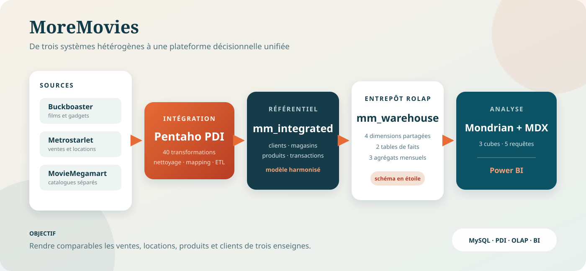

# MoreMovies

**Chaîne décisionnelle complète pour un réseau de vente et de location de films et de gadgets.**

MoreMovies consolide trois systèmes transactionnels hétérogènes dans un modèle
commun, puis alimente un entrepôt ROLAP exploitable en MDX et dans Power BI. Le
projet couvre la modélisation, l'intégration ETL, l'optimisation analytique et la
préparation du reporting.



## En bref

| Sources | Transformations PDI | Tables SQL | Modèle décisionnel | Analyses MDX |
|---:|---:|---:|---:|---:|
| 3 | 40 | 37 | 4 dimensions, 2 faits, 3 agrégats | 5 |

## Problème traité

Les enseignes Buckboaster, Metrostarlet et MovieMegamart décrivent les mêmes
activités avec des structures, des identifiants et des niveaux de détail
différents. MoreMovies construit un référentiel commun pour répondre notamment
aux questions suivantes :

- comment évoluent les chiffres d'affaires de vente et de location ?
- quels magasins et produits contribuent le plus aux résultats ?
- quels films sont les plus vendus ou loués selon la période ?
- quels profils clients utilisent le service de location ?

## Architecture

1. **Sources** : reproduction des trois schémas opérationnels dans MySQL.
2. **Intégration** : extraction, nettoyage, dédoublonnage et harmonisation avec
   Pentaho Data Integration.
3. **Référentiel commun** : chargement des clients, magasins, produits, ventes
   et locations dans `mm_integrated`.
4. **Entrepôt ROLAP** : alimentation de quatre dimensions, de deux tables de
   faits et de trois tables d'agrégats dans `mm_warehouse`.
5. **Analyse** : exposition de trois cubes Mondrian, requêtes MDX et exports
   tabulaires destinés au reporting Power BI.

La conception et les règles de correspondance sont détaillées dans
[`docs/architecture.md`](docs/architecture.md).

## Modèle décisionnel

Le schéma en étoile partage quatre dimensions :

- `DIM_MAGASIN` : réseau et magasin ;
- `DIM_PRODUIT` : film ou gadget, titre et catégorie ;
- `DIM_CLIENT` : genre et tranches d'âge ;
- `DIM_PERIODE` : année, mois et jour.

Les événements sont stockés dans `FACT_VENTE` et `FACT_LOCATION`. Trois tables
d'agrégats accélèrent les analyses mensuelles par magasin et par produit.

Le catalogue Mondrian expose les cubes `Ventes`, `Locations` et
`CA Global Mensuel`, avec des mesures telles que le chiffre d'affaires, le
nombre de transactions, le nombre de clients et la durée moyenne de location.

## Structure du dépôt

```text
moremovies/
├── sql/mysql/       # schémas sources, base intégrée et entrepôt ROLAP
├── pdi/             # 40 transformations Pentaho organisées par couche
├── mondrian/        # catalogue OLAP, requêtes MDX et runners locaux
├── pbi_exports/     # exports SQL et spécification du rapport Power BI
├── docs/            # architecture et modèles conceptuels
└── scripts/         # contrôles de cohérence du dépôt
```

## Démarrage

### Prérequis

- MySQL ou MariaDB ;
- Pentaho Data Integration 9.x pour exécuter les fichiers `.ktr` ;
- Java et les bibliothèques Mondrian pour le runner OLAP ;
- Power BI Desktop uniquement pour construire le rapport final.

### 1. Créer les bases

Exécuter les scripts de [`sql/mysql`](sql/mysql) dans l'ordre numérique :

```bash
mysql -u root -p < sql/mysql/00_create_databases.sql
mysql -u root -p < sql/mysql/01_source_buckboaster.sql
mysql -u root -p < sql/mysql/02_source_metrostarlet.sql
mysql -u root -p < sql/mysql/03_source_moviemegamart.sql
mysql -u root -p < sql/mysql/04_integrated.sql
mysql -u root -p < sql/mysql/05_warehouse_rolap.sql
```

### 2. Configurer les flux ETL

Ouvrir les transformations de [`pdi`](pdi) dans Spoon, puis remplacer les
valeurs `change_me` et les chemins `/path/to/exports_csv/...` par la
configuration locale. L'ordre des couches est : sources, intégration, entrepôt.

### 3. Interroger les cubes

Copier le fichier d'environnement d'exemple et renseigner un utilisateur MySQL
disposant uniquement d'un droit de lecture sur `mm_warehouse` :

```bash
cp mondrian/local/mondrian.env.example mondrian/local/mondrian.env
./mondrian/local/run_mdx.sh \
  mondrian/mdx/01_ca_total_par_magasin_et_par_annee.mdx
```

Le mode XML/A est décrit dans
[`mondrian/README_xmla_local.md`](mondrian/README_xmla_local.md).

### 4. Préparer Power BI

Une fois l'entrepôt alimenté, générer les fichiers d'analyse :

```bash
PBI_EXPORT_MYSQL_PASSWORD='...' ./pbi_exports/export_pbi_tsv.sh
```

La structure recommandée du rapport est documentée dans
[`pbi_exports/reporting_specification.md`](pbi_exports/reporting_specification.md).

## Qualité et sécurité

Le dépôt public ne contient ni données brutes, ni mot de passe, ni fichier
d'environnement local. Les connexions PDI utilisent des valeurs neutres qui
doivent être configurées avant exécution.

Le contrôle suivant valide les fichiers XML/PDI, les volumes attendus et
l'absence d'artefacts privés connus :

```bash
python3 scripts/validate_repository.py
```

## Technologies

`MySQL` · `Pentaho Data Integration` · `Mondrian` · `MDX` · `Java` · `Power BI`
